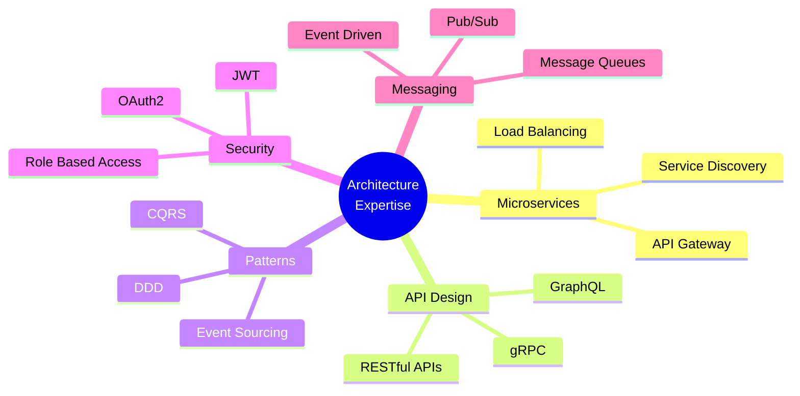

## 💼 Technical Expertise

### 🔤 Core Programming Languages

| Language | Proficiency | Experience Level |
|----------|-------------|------------------|
| **Java** | ⬛⬛⬛⬛⬛⬛⬛⬛⬛⬜ | Expert (95%) |
| **JavaScript/TypeScript** | ⬛⬛⬛⬛⬛⬛⬛⬛⬛⬜ | Expert (90%) |
| **C/C++** | ⬛⬛⬛⬛⬛⬛⬛⬛⬜⬜ | Advanced (80%) |
| **Python** | ⬛⬛⬛⬛⬛⬛⬛⬜⬜⬜ | Advanced (75%) |
| **PHP** | ⬛⬛⬛⬛⬛⬛⬛⬜⬜⬜ | Proficient (70%) |

---

### 🎨 Frontend Development

<table>
<tr>
<td width="50%" valign="top">

#### **Frameworks & Libraries**

| Technology | Level |
|------------|-------|
|  | ⭐⭐⭐⭐⭐ |
|  | ⭐⭐⭐⭐⭐ |
|  | ⭐⭐⭐⭐☆ |
|  | ⭐⭐⭐⭐☆ |

</td>
<td width="50%" valign="top">

#### **Styling & Design Systems**

| Technology | Level |
|------------|-------|
|  | ⭐⭐⭐⭐⭐ |
|  | ⭐⭐⭐⭐⭐ |
|  | ⭐⭐⭐⭐☆ |
|  | ⭐⭐⭐⭐☆ |

</td>
</tr>
</table>

---

### ⚙️ Backend Development

<table>
<tr>
<td width="50%" valign="top">

#### **Java Ecosystem**

#### **Node.js Ecosystem**

</td>
<td width="50%" valign="top">

#### **PHP Ecosystem**

#### **Python Ecosystem**

</td>
</tr>
</table>

---

### 🗄️ Database & Caching Solutions

#### **Relational Databases**

#### **NoSQL & Caching**

---

### 🔄 DevOps & Cloud Infrastructure

<table>
<tr>
<td width="33%" valign="top" align="center">

#### **🐳 Containerization**

</td>
<td width="33%" valign="top" align="center">

#### **🚀 CI/CD Pipeline**

</td>
<td width="33%" valign="top" align="center">

#### **📊 Monitoring & Quality**

</td>
</tr>
</table>

---

### 🏗️ Architecture & Design Principles

<table>
<tr>
<td width="50%" valign="top">

**Architectural Patterns**
- 🎯 Microservices Architecture
- 🏛️ Domain-Driven Design (DDD)
- 📡 Event-Driven Architecture
- 🔄 CQRS & Event Sourcing
- 🧅 Layered Architecture

</td>
<td width="50%" valign="top">

**Design & Best Practices**
- 🏭 Gang of Four Design Patterns
- 🔐 Security Best Practices (OAuth2, JWT)
- 🧪 Test-Driven Development (TDD)
- 📚 Clean Code Principles
- 🔄 RESTful API Design Standards

</td>
</tr>
</table>

---

### 🎯 Areas of Specialization

| Domain | Key Technologies | Experience |
|--------|-----------------|------------|
| **Full-Stack Development** | MERN, Spring Boot + Angular, Laravel + Vue | ⭐⭐⭐⭐⭐ |
| **Microservices** | Spring Cloud, Docker, Kubernetes, Service Mesh | ⭐⭐⭐⭐⭐ |
| **DevOps Engineering** | CI/CD Pipelines, Infrastructure as Code, Monitoring | ⭐⭐⭐⭐⭐ |
| **Cloud Architecture** | Distributed Systems, Scalability, High Availability | ⭐⭐⭐⭐☆ |
| **Machine Learning Ops** | Model Deployment, ML Pipelines, Prediction APIs | ⭐⭐⭐⭐☆ |

