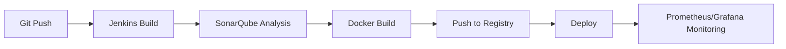

<div align="center">

# 👨‍💻 Aymen Jallouli

### Full-Stack Software Engineer | DevOps Enthusiast | Cloud Architecture

[](https://www.linkedin.com/in/aymen-jallouli-713534254/)
[](mailto:aymen.jallouli@esprit.tn)
[](https://github.com/Aymenjallouli)

</div>

---

## 🎯 Professional Summary

Passionate full-stack developer with expertise in building **scalable**, **resilient**, and **high-performance** applications. Specialized in modern web technologies, microservices architecture, and DevOps practices. Committed to delivering clean, maintainable code while following industry best practices and software design principles.

---

## 💼 Technical Expertise

### Core Programming Languages
```text
Java          ████████████████████░   95%
JavaScript/TS ███████████████████░░   90%
C/C++         ████████████████░░░░░   80%
Python        ███████████████░░░░░░   75%
PHP           ██████████████░░░░░░░   70%
```

### 🎨 Frontend Development
<table>
<tr>
<td valign="top" width="50%">

**Frameworks & Libraries**
-  React.js
-  Angular
-  Next.js
-  Vue.js

</td>
<td valign="top" width="50%">

**Styling & UI**
-  Tailwind CSS
-  Bootstrap
-  Material-UI
-  Sass/SCSS

</td>
</tr>
</table>

### ⚙️ Backend Development
<table>
<tr>
<td valign="top" width="50%">

**Java Ecosystem**
-  Spring Boot
-  Spring Cloud
-  Hibernate/JPA

**Node.js Ecosystem**
-  Node.js
-  Express.js
-  NestJS

</td>
<td valign="top" width="50%">

**PHP Ecosystem**
-  Laravel
-  Symfony

**Python Ecosystem**
-  Django
-  Flask
-  FastAPI

</td>
</tr>
</table>

### 🗄️ Database & Caching


### 🔄 DevOps & Cloud Infrastructure
<table>
<tr>
<td valign="top" width="33%">

**Containerization**
-  Docker
-  Kubernetes
-  Docker Compose

</td>
<td valign="top" width="33%">

**CI/CD & Automation**
-  Jenkins
-  GitHub Actions
-  GitLab CI

</td>
<td valign="top" width="33%">

**Monitoring & Quality**
-  Prometheus
-  Grafana
-  SonarQube

</td>
</tr>
</table>

### 🏗️ Architecture & Design Patterns
- 🎯 Microservices Architecture
- 🔄 RESTful API Design
- 📡 Event-Driven Architecture
- 🧩 Domain-Driven Design (DDD)
- 🏭 Design Patterns (Factory, Singleton, Observer, etc.)
- 🔐 OAuth2 & JWT Authentication

---

## 🚀 Featured Projects

### 🤖 [AI Smart Dashboard](https://github.com/Aymenjallouli/Ai-Dashboard-Ml) • [Live Demo](https://parkini-smart-dashboard.onrender.com)
> Intelligent parking prediction system using machine learning

**Tech Stack:** Flask • React • Scikit-learn • XGBoost • Material-UI • Chart.js  
**Features:**
- ML-powered parking duration prediction
- Real-time occupancy forecasting
- Interactive data visualization dashboard
- RESTful API for predictions

---

### 🅿️ [Parkini - Smart Parking System](https://github.com/PiDev-2025/Parkini) • [Live Demo](https://front-end-front-office.vercel.app)
> End-to-end intelligent parking management solution

**Tech Stack:** Express.js • React • Jenkins • Docker • Prometheus • Grafana  
**Architecture:**
- Complete CI/CD pipeline with automated testing
- Containerized microservices deployment
- Real-time monitoring and alerting
- Code quality gates with SonarQube

**DevOps Pipeline:**


---

### 🍽️ [Distributed Restaurant Management System](https://github.com/Application-Web-Distribution-Project/Application_Web_Distibue)
> Scalable microservices architecture for restaurant order management

**Tech Stack:** Spring Boot • Angular • Eureka • API Gateway • RabbitMQ  
**Architecture Highlights:**
- Service discovery with Netflix Eureka
- Centralized API Gateway routing
- Event-driven communication
- Distributed transaction management
- Load balancing and fault tolerance

---

### 🔧 [Enterprise DevOps Pipeline](https://github.com/marwaniiwael18/DEVOPS-Project/tree/Aymenjallouli_4twin3_thunder)
> Production-ready CI/CD infrastructure

**Tech Stack:** Jenkins • SonarQube • Nexus • Docker • Prometheus • Grafana  
**Implementation:**
- Automated build and deployment workflows
- Artifact management with Nexus Repository
- Security scanning and vulnerability detection
- Performance metrics and application monitoring
- Infrastructure as Code (IaC)

---

## 📊 GitHub Statistics

<div align="center">


</div>

---

## 🎓 Continuous Learning

Currently exploring:
- 🔐 Advanced Kubernetes orchestration
- ☁️ AWS/Azure cloud architectures
- 🧠 Machine Learning operations (MLOps)
- 🔄 GraphQL and Apollo Federation
- 🌐 Web3 and blockchain technologies

---

## 📫 Let's Connect

<div align="center">

[](https://www.linkedin.com/in/aymen-jallouli-713534254/)
[](mailto:aymen.jallouli@esprit.tn)
[](#)

**Open to collaboration on innovative projects and exciting opportunities!**

</div>

---

<div align="center">

### ⚡ "Code is like humor. When you have to explain it, it's bad." - Cory House


</div>
