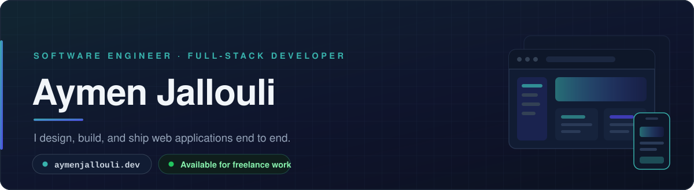

<!-- ═══════════════════════════ HEADER ═══════════════════════════ -->

  
  
  

 

<!-- ═══════════════════════════ ABOUT ═══════════════════════════ -->

## 🧭 About

I build **production-grade applications end to end** — from the API contract to the Grafana dashboard that watches it in production.

My focus sits where most teams struggle: **clean backend architecture, interfaces people enjoy using, and the automation that keeps both shipping safely.**

<table>
<tr><td width="20">🎓</td><td><b>Engineering student</b> at ESPRIT, Tunisia</td></tr>
<tr><td>🔭</td><td>Currently building <b>predictive ML dashboards</b> and self-healing CI/CD pipelines</td></tr>
<tr><td>🌱</td><td>Going deeper on <b>Kubernetes operators</b> and event-driven architecture</td></tr>
<tr><td>💼</td><td>Open to <b>internships, freelance work, and open-source collaboration</b></td></tr>
<tr><td>🌐</td><td>Full portfolio → <a href="https://aymenjallouli.dev/"><b>aymenjallouli.dev</b></a></td></tr>
</table>

 

<!-- ═══════════════════════════ STACK ═══════════════════════════ -->

## ⚙️ Tech Stack

<table align="center">
  <tr>
    <td align="right" width="120"><b>Languages</b></td>
    <td></td>
  </tr>
  <tr>
    <td align="right"><b>Frontend</b></td>
    <td></td>
  </tr>
  <tr>
    <td align="right"><b>Backend</b></td>
    <td></td>
  </tr>
  <tr>
    <td align="right"><b>Data</b></td>
    <td></td>
  </tr>
  <tr>
    <td align="right"><b>DevOps</b></td>
    <td></td>
  </tr>
</table>

<b>🔍 Tooling & specifics</b>

 

| Area | Tools |
|:--|:--|
| **Quality & Security** | SonarQube · JUnit · Mockito · ESLint |
| **Artifacts & Registry** | Nexus · Docker Hub |
| **Monitoring** | Prometheus · Grafana · Alertmanager |
| **Architecture** | REST · API Gateway · Eureka Service Discovery · Event-driven |
| **ML / Data** | Scikit-learn · XGBoost · Pandas · NumPy |
| **Deployment** | Vercel · Render · Docker Compose |

 

<!-- ═══════════════════════════ PROJECTS ═══════════════════════════ -->

## 🚀 Featured Work

<table>
<tr>
<td width="50%" valign="top">

<!-- 📸 Drop a screenshot here for maximum impact:
      -->

### [Parkini →](https://github.com/PiDev-2025/Parkini)

**Intelligent parking management platform.** Booking and reservation flows backed by a full DevOps chain — automated builds, quality gates, containerized delivery, and live metrics.

</td>
<td width="50%" valign="top">

### [AI Smart Dashboard →](https://github.com/Aymenjallouli/Ai-Dashboard-Ml)

**Predictive analytics for parking demand.** ML models forecast duration and availability, served through a Flask API and visualized in an interactive React dashboard.

</td>
</tr>
<tr>
<td width="50%" valign="top">

### [Distributed Web Application →](https://github.com/Application-Web-Distribution-Project/Application_Web_Distibue)

**Microservices restaurant order system.** Order management split into independent services behind an API Gateway, with dynamic registration and service discovery.

</td>
<td width="50%" valign="top">

### [DevOps Automation Pipeline →](https://github.com/marwaniiwael18/DEVOPS-Project/tree/Aymenjallouli_4twin3_thunder)

**End-to-end CI/CD with quality control.** Build, test, static analysis, artifact publishing, and containerized deployment triggered on every commit.

</td>
</tr>
</table>

  <a href="https://aymenjallouli.dev/"><b>See all projects and case studies on aymenjallouli.dev →</b></a>

 

<!-- ═══════════════════════════ STATS ═══════════════════════════ -->

## 📈 GitHub Analytics

  
  

 

<!-- ═══════════════════════════ CONTACT ═══════════════════════════ -->

## 🤝 Let's Build Something

Open to **internships, freelance projects, and open-source collaboration** — especially distributed systems, DevOps culture, and applied ML.

  
  
  

<i>Make it work, make it right, make it fast — then automate it.</i>

